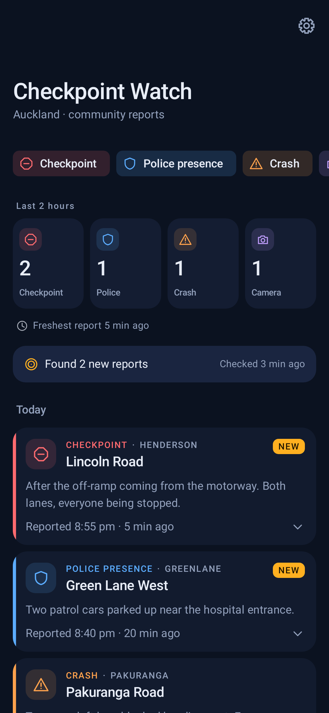
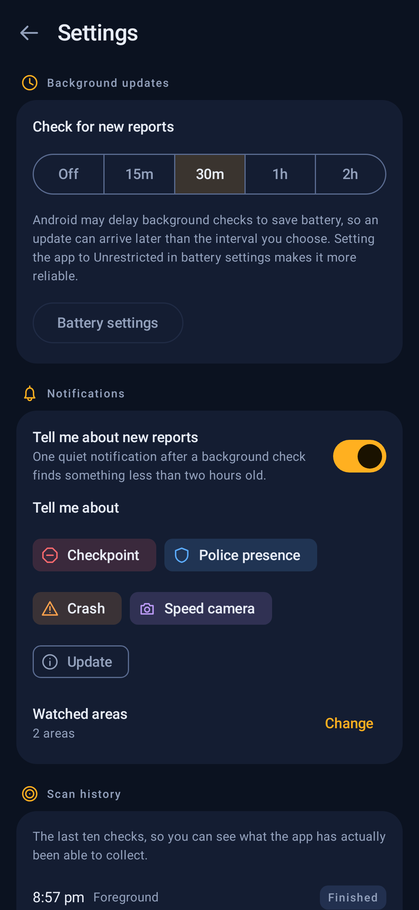

# Checkpoint Watch

A personal Android app that keeps a private log of the road reports (checkpoints,
police presence, crashes, speed cameras) posted to the public Facebook page
**Checkpoint Watch Auckland** — without needing a Facebook account, and without
ever putting Facebook's own app or website in front of you.

<p>
  
  
</p>

## What it is, and what it isn't

Checkpoint Watch reads whatever the public page happens to have posted, and
shows it to you in its own screen. That's all it does.

- It does **not** verify anything it shows. A report is exactly what someone
  posted to that public page — unconfirmed, unmoderated by this app, and
  sometimes wrong, stale, or a joke.
- It does **not** know whether a checkpoint is still there. Reports don't
  disappear from the list when they're no longer current; the app only shows
  how old each one is and lets time speak for itself.
- It must **never** be used to decide whether it is safe or legal to drive,
  or to plan how to avoid police. Obey the road rules regardless of what this
  app says or doesn't say.
- It is a personal project, built for one person's own use. It is **not
  affiliated with, endorsed by, or connected to Facebook, Meta, or the
  Checkpoint Watch Auckland page** in any way. It just reads a public page,
  the same way a person scrolling past could.

## How it works

The app opens the public Facebook page in a WebView that is never shown on
screen (it sits behind the app's own UI, fully covered). It waits for the
page to load as a logged-out visitor, closes the one login prompt Facebook
shows, and lets the page load a bit further, then reads the post data the
page itself already downloaded. It never logs in, never asks for a password,
and never touches any Facebook account.

A few things follow from that:

- **About 10 posts per visit.** That's a limit Facebook itself puts on
  logged-out visitors, not a choice this app makes. Each scan sees the ~10
  newest posts; anything posted between one scan and the next is picked up
  next time, as long as it's still within the newest ~10.
- **Gaps are possible and are shown honestly.** If the app hasn't been
  opened (and, if you turn it on, hasn't run a background check) for longer
  than it takes the page to post 10 more reports, some reports in between
  are missed. The app never pretends its history is complete — it marks the
  point where a gap happened.
- **A report going quiet doesn't mean it's over.** The app has no way to know
  when a checkpoint clears; it just shows a report's age, fading it out as it
  gets older.
- **Facebook is never displayed.** The WebView is a data source, not a
  screen you look at. Everything you see is the app's own design.

## Privacy

- The app talks to exactly one address: `www.facebook.com`. It has no
  analytics, no crash reporting, no third-party network calls of any kind.
- There is no account, no sign-in, and no data sent about you to anyone.
- Everything the app collects stays in a local database on your phone. There
  is no export, no backup, and no cloud sync — deleting the app deletes the
  data.

## Installing on GrapheneOS with Obtainium

Checkpoint Watch isn't on any app store. Releases are published as an APK
file attached to a GitHub release, and [Obtainium](https://github.com/ImranR98/Obtainium)
is used to install and update it from there.

1. Install Obtainium (from F-Droid or its own release page) if it isn't
   already on the phone.
2. In Obtainium, choose **Add App** and paste the GitHub repository URL for
   this project.
3. Obtainium reads the repository's releases and offers the APK attached to
   the latest one. Confirm, and it installs.
4. GrapheneOS will ask you to allow Obtainium to install apps the first
   time — allow it, the same as you would for any other installer app you
   trust.
5. From then on, opening Obtainium and checking for updates (or letting it
   check on its own schedule) will offer new versions the same way, as long
   as every release is signed with the same key (see *Making a release*
   below).

Once installed, leave the app's **Network** permission switched on in
GrapheneOS's app info screen — without it the app can't reach the Facebook
page at all, and every scan will simply fail.

## First-run checklist

After installing, it's worth checking these on the phone once, since none of
this was verified on a real device before release:

1. Open the app. Within a few seconds it should report finding around 10
   posts (fewer is fine if the page has posted less than that recently).
2. At no point should Facebook's own page or a Facebook login screen appear
   on screen — only the app's own list.
3. Leave the app (press home, or lock the phone) while it's still scanning,
   then come straight back. The scan should have stopped rather than kept
   running underneath.
4. Open the app a second time shortly after. It should say "No new reports"
   rather than re-finding the same ones.
5. In Settings, turn on **Check for new reports** and pick an interval, then
   turn on **Tell me about new reports** if you want notifications.
6. Tap **Battery settings** from the Settings screen and set the app to
   **Unrestricted** — otherwise Android can quietly delay or skip background
   checks to save power.
7. Come back later (after at least one background interval has passed) and
   check **Scan history** in Settings. You should see rows marked
   **Background**, each showing which collector it used to gather data
   (`WEBVIEW`, `WEBVIEW_DOM`, or `HTTP` — see *Background updates* below).

## Background updates and notifications

Both are optional and off by default.

- **Background updates** run the same scan the app runs when you open it,
  on a timer (15 minutes to 2 hours), without you opening the app. Android
  is allowed to delay these to save battery — setting the app to
  Unrestricted (step 6 above) makes that less likely, but there's no way to
  guarantee a background check runs exactly on time.
- A background check has no on-screen window to load the page in, so it
  runs the WebView invisibly in the background. If that doesn't manage to
  collect any posts, the app falls back to a plain, no-JavaScript request
  that can only ever pick up the single newest post — better than nothing,
  but not a full scan. Which method a given check used is recorded and shown
  in Scan history, so this is something you can actually check rather than
  take on faith.
- **Notifications** are a single, quiet notification after a background
  check finds something new that's less than two hours old, grouped into one
  notification per check rather than one per report. You choose which
  report types and which areas trigger one. Nothing is ever sent if you
  never turn this on, and Android will only ask for notification permission
  the moment you do.

## Building from source

Requirements: JDK 17, and the Android SDK with platform 36 installed
(matching `compileSdk`/`targetSdk` in `app/build.gradle.kts`). The Gradle
wrapper handles the rest.

```
./gradlew assembleDebug
```

Run the unit tests (pure Kotlin/JVM, no device or emulator needed):

```
./gradlew testDebugUnitTest
```

The two screenshots above are produced by a Robolectric/Roborazzi test that
renders the Compose screens to PNGs. If they're missing or stale, regenerate
them with:

```
./gradlew testDebugUnitTest --tests '*ScreenshotTest*' -Proborazzi.test.record=true
```

then copy the ones you want (`app/build/outputs/roborazzi/home_dark.png`,
`settings_dark.png`) into `docs/screenshots/`.

## Making a release

Obtainium (and Android itself) require every update to be signed with the
same key as the version it's replacing. That signing key is never committed
to this repository — it's created once, kept privately, and reused for every
release from then on.

**Create the keystore once** (only ever needs doing a single time, on
whichever machine will build releases):

```
keytool -genkeypair -v -keystore /somewhere/outside/the/repo/checkpoint-watch-release.jks \
  -alias checkpoint-watch -keyalg RSA -keysize 2048 -validity 10000
```

Keep the resulting `.jks` file and its passwords **outside this repository**
and back them up somewhere safe (a password manager, an encrypted drive).
**If this key is ever lost, Obtainium will not be able to update the app
already installed on the phone** — the only recovery is uninstalling and
reinstalling from scratch, which loses the local database. Treat it like a
password you can never reset.

Point the build at that keystore by creating `keystore.properties` at the
repository root (this file is git-ignored and must never be committed):

```
storeFile=/somewhere/outside/the/repo/checkpoint-watch-release.jks
storePassword=...
keyAlias=checkpoint-watch
keyPassword=...
```

With that file in place, `assembleRelease` signs with the real key instead
of falling back to the debug key (Gradle prints a warning if the file is
missing, so a fallback-signed build is never accidentally mistaken for a
real one).

To cut a release:

```
./gradlew -PversionCode=2 -PversionName=1.1.0 :app:packageReleaseApk
gh release create v1.1.0 dist/checkpoint-watch-1.1.0.apk
```

`versionCode` must go up by at least 1 each time; `versionName` is whatever
you want shown to Obtainium and on the phone. `:app:packageReleaseApk`
builds, signs, and copies the APK to `dist/checkpoint-watch-<versionName>.apk`
(also git-ignored). The `gh release create` step is what actually publishes
it — done separately, deliberately, by whoever is doing the release.

## If Facebook changes something

All the knowledge of what Facebook's page currently looks like is
deliberately kept in two small, isolated places, so a change on Facebook's
end can be fixed without touching anything else in the app:

- **`app/src/main/assets/collector.js`** — runs inside the hidden WebView.
  If Facebook renames its login dialog's close button, changes the "See
  more" wording, or otherwise changes the page's structure, this is where
  the selectors and the click/scroll loop live.
- **`app/src/main/java/nz/personal/checkpointwatch/collect/FeedJsonExtractor.kt`**
  — pulls posts out of the raw data the page sends back. If Facebook renames
  the `post_id` / `message.text` / `creation_time` fields in its responses,
  this is where the field names live.

Both have a plain-Kotlin/plain-JS test suite that doesn't need a phone:

```
./gradlew testDebugUnitTest
node app/src/test/js/collector.test.js
```

Fixtures captured from the real page live under `app/src/test/resources/`
(JSON responses) and are referenced directly by the Kotlin tests — replacing
them with freshly captured data is usually the fastest way to confirm a fix
after Facebook changes something.

## Known limits

- Sees at most ~10 posts per scan; longer gaps between scans mean missed
  reports, which the app marks but cannot recover.
- Depends entirely on Facebook's page continuing to work the way it does
  today; there is no guarantee it will keep working if Facebook changes the
  page.
- Background checks can be delayed or skipped by Android's battery
  management, especially if the app isn't set to Unrestricted.
- No export or backup of the collected data.
- Everything shown comes from unverified public posts — see *What it is,
  and what it isn't* above.

## Licence

Personal project. No licence granted yet.
